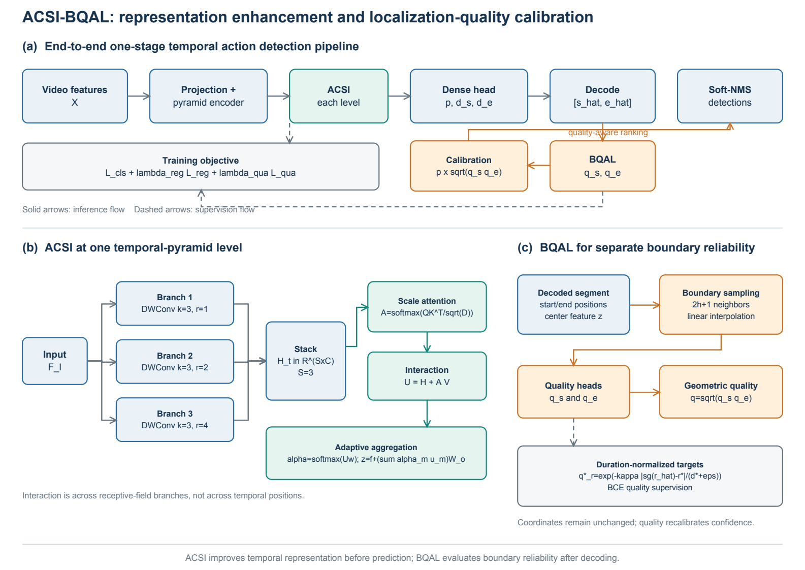

# ACSI-BQAL for Temporal Action Detection

Reference PyTorch implementation of **Adaptive Cross-Scale Interaction
(ACSI)** and **Boundary Quality-Aware Learning (BQAL)** for one-stage temporal
action detection.

ACSI builds parallel temporal branches with complementary receptive fields,
models their relationships at every temporal location, and performs
content-dependent aggregation. BQAL samples local evidence around decoded
starting and ending boundaries, predicts their reliability separately, and
calibrates classification confidence using their geometric mean.



## Installation

```bash
git clone https://github.com/ZaoGaoAAA/ACSI-BQAL.git
cd ACSI-BQAL
python -m pip install -e .
```

## Minimal example

```python
import torch
from acsi_bqal import AdaptiveCrossScaleInteraction, BoundaryQualityHead

x = torch.randn(2, 256, 128)
acsi = AdaptiveCrossScaleInteraction(256, interaction_dim=128)
z = acsi(x)

centers = z.transpose(1, 2)[:, :16]
start = torch.rand(2, 16) * 80
end = start + torch.rand(2, 16) * 20 + 1
bqal = BoundaryQualityHead(256, hidden_channels=128, radius=2)
q_start, q_end = bqal(z, centers, start, end)
```

The default settings used in the paper are recorded in
[`configs/default.yaml`](configs/default.yaml). The module input convention is
`[batch, channels, time]`, matching OpenTAD temporal features. The modules can
be inserted after each temporal-pyramid output and before the dense prediction
head. BQAL consumes decoded boundary positions expressed in the corresponding
feature-grid coordinates.

## Tests

```bash
python -m pip install -r requirements.txt
pytest
```

## Reproducibility notes

- ACSI branch specifications: `(kernel, dilation) = (3,1), (3,2), (3,4)`.
- Scale-interaction dimension: `128`.
- BQAL neighborhood radius: `2`.
- Boundary-target decay coefficient: `4`.
- Quality-loss weight: `0.5`.
- Classification and regression losses, target assignment, decoding, and
  Soft-NMS follow the ActionFormer configuration in OpenTAD.

## License

Apache License 2.0. See [`LICENSE`](LICENSE).
